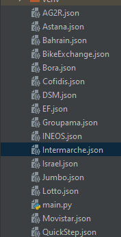
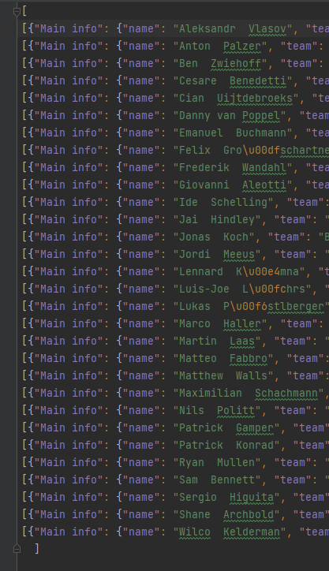

# Documentation: Rider API Gather

## Language: Python
## Time Spent(Start To Finish): 0h30m

<hr>

## Why Make This?

For further projects I didn't want to have to rely on constant api calls and servers being up for websites and services I was not confident on the reliability of. Luckily for my purposes I do not need the data to be constantly up to date and only required the years data. 

This allows me to have JSON copies of all the information I need sorted into JSON files for each team. As seen here;



## How I Gathered The Information

The documentation of my [Rider Scraper](https://github.com/MathewBravo/ScrapeForRiderNames#readme) showcases how apis are called in python and also shows the api that I used. 

```python
import re
import requests
import json

f = open("D:\\Programming stuff\\Python\\Python Bootcamp\\RiderAPIGather\\UAE Team Emirates", 'r')

data = f.read()

# Parsing data from text file
results = re.search("'(.*)'", data)
ridersNoQuotes = results.group().replace("'", "")
ridersNoWhiteSpace = ridersNoQuotes.replace(" ", "")
riders = ridersNoWhiteSpace
rider_list = riders.split(",")
```
#### Imports

[**requests**](https://requests.readthedocs.io/en/latest/): Allows for the sending of HTTP requests without manually adding query strings. 

[**re**](https://docs.python.org/3/library/re.html): Provides the reuglar expression matching used to match the href tag since the HTML of ProCyclingStats is not formatted in a way in which the riders have identifiable tags. 

[**json**](https://www.w3schools.com/python/python_json.asp): Provides the ability to work with JSON data.


I then open the files created in [Rider Scraper](https://github.com/MathewBravo/ScrapeForRiderNames#readme), and parse the data to eventually end up with a riders list called rider_list this contains the search string needed to make an API call. These strings look like this;

```text
rafal-majka
rui-costa
rui-oliveira
ryan-gibbons
tadej-pogacar
```

We can concatenate these strings and for each *rider* in the rider list call the api and gather the information from the return GET.

```python
 response = requests.request("GET", url, headers=headers)
    jsonresponse = response.json();
    with open('UAE.json', "a+") as f:
        f.seek(0)
        file_data = f.read(100)
        if len(file_data) > 0:
            f.write('\n')
        f.write(json.dumps(jsonresponse))
```

Finally, we can parse the response into a json version of the response. We can then create a .json file and pass all the information into the file and end up with the following;



#### *Note*

```python
    f.seek(0)
    file_data = f.read(100)
    if len(file_data) > 0:
        f.write('\n')
```

The purpose of the above code is to check to see if the file has information already in it and then if it does add a new line to the appended information purely to allow it to be more easily read after all the data is added. 